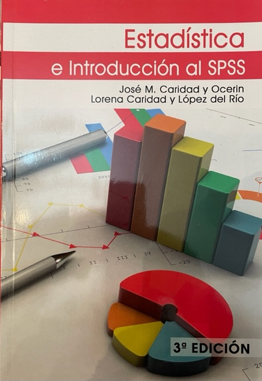

```{r setup, include=FALSE}
options(htmltools.dir.version = FALSE)
knitr::opts_chunk$set(fig.align = "center", cache = TRUE)
```

# Outline

## **- Aspectos Metodológicos de la Asignatura.**

## 1. Docentes.

## 2. Requisitos, Recomendaciones y Referencia.

## 3. Competencias del Alumno y Objetivos.

## 4. Metodología y Evaluación.

## 5. Contenidos de la Asignatura.

---

class: inverse, left, middle

#  </br> Aspectos Metodológicos de la Asignatura.

---

# 1. Docentes 

## **- Profesores:** Manuel Pérez Priego (Coordinador): <span style="color:blue">mppriego@uco.es</span>

## José Rafael Caro Barrera: <span style="color:blue">jrcaro@uco.es</span>

## **- Despacho:** Facultad de RRLL, 1ª planta, Área Estadística.

## **- Tutorías:** <span style="color:red">Por confirmar día y hora o con cita previa.</span>

## **- Material de Trabajo Disponible:** Moodle de la asignatura.

### - Casos y supuestos prácticos
### - Ejercicios y problemas
### - Referencias bibliográficas

---

# 2. Requisitos, Recomendaciones y Referencia

.pull-left[



]

.pull-right[

### - <span style="color:red">Haber cursado al menos la asignatura de Estadística</span>, en la que se adquiere una base teórica necesaria para el correcto seguimiento de la asignatura.

### - No obstante, se hará algún recordatorio de aquellos conceptos básicos que se consideren fundamentales.

### - Manual de la asignatura: <span style="color:blue">**Estadística e Introducción a SPSS**</span>.


]

---

# 3. Competencias del Alumno y Objetivos.

.pull-left[

<div style="font-size: 22.5px">

Cod. | Competencias
:---- | :---------
CB3  | Ser capaz de **gestionar la información**
CB4  | Capacidad de **interpretación cualitativa y/o cuantitativa de datos**.
CB9  | Capacidad para **aplicar los conocimientos teóricos** fundamentales a la resolución de problemas.
CE3  | Capacidad de **análisis multidisciplinar de datos, índices e indicadores** cualitativos y cuantitativos.
CE4  | Ser capaz de **diseñar, planificar y ejecutar** investigaciones prácticas valorando los resultados.
CE6  | Ser capaz de **aplicar métodos estadísticos** a datos relacionados con problemas del ámbito de las RRLL y los RRHH.
</div >
]

.pull-right[
<div style="font-size: 23px">

| Se pretende conseguir que el alumno sea capaz de:
|:---------------------------------------------------------------------------------------------------------------|
| I) Formular problemas reales en términos estadísticos.                                                         |
| II) Diseñar la adecuada toma de datos para adquirir información de una población objeto de estudio.           |
| III) Describir y analizar dicha información.                                                                   |
| IV) Aplicar la inferencia estadística para la estimación de parámetros y los contrastes más usuales sobre ellos.|
| V) Tener el suficiente conocimiento de las distintas herramientas para poder aplicar las técnicas estadísticas más adecuadas a los distintos problemas y analizar críticamente los resultados de los análisis estadísticos aplicados. |
</div >
]

---
# 4. Metodología y Evaluación.

<div style="font-size: 40px"> Clases Prácticas:</div >
<div style="font-size: 30px"> - Repaso de conceptos teóricos básicos</div >
<div style="font-size: 30px"> - Aplicaciones a problemas reales</div >
<div style="font-size: 30px"> - Uso del software estadístico <span style="color:blue"> SPSS </span>.</div >

</br>

.pull-left[
<div style="font-size: 25px">

Actividad | Porcentaje
:----     | :----
Examen | 60%
Ejercicios clase simulados | 20%
Informe prácticas grupales | 20%

</div >

]

---

# 4. Metodología y Evaluación (continuación).

<div style="font-size: 30px">

<span style="color:red">**- Examen:**</span> será de aplicaciones prácticas siendo con ordenador, bien del centro o propio, por lo que se aconseja que el alumno trabaje y repita los casos prácticos en casa. Será necesario obtener como mínimo una nota igual a <span style="color:green">**4**</span> en cada parte para hacer media, así como para que computen los problemas y el informe de prácticas grupal.

<span style="color:blue">**- Casos prácticos:**</span> al finalizar cada tema (o cuando haya suficiente material) se hará un ejercicio práctico en la hora de la clase, del tipo que se pondrá en el examen y será enfocado como un simulacro del mismo. La entrega, mediante la subida a la correspondiente tarea, servirá para el 20% de la evaluación.

<span style="color:green">**- Informe de prácticas grupal:**</span> En grupos de 5-6 alumnos se expondrá el análisis de un caso práctico que previamente se habrá trabajado.

**Nota final** =  (<span style="color:red">0.6 x Examen</span> + <span style="color:blue">0.2 x Casos prácticos</span> + <span style="color:green">0.2 x Informe de prácticas grupal</span>)

</div >


---
# 5. Contenidos de la Asignatura.

<div style="font-size: 35px">
<span style="color:blue">**1. El Análisis de Datos y la Estadística**</span>

<span style="color:blue">**2. Escalas de medida**</span>

<span style="color:blue">**3. Distribuciones de frecuencias univariantes**</span>

<span style="color:blue">**4. Medidas descriptivas de variables numéricas**</span>

<span style="color:blue">**5. Análisis Bivariante**</span>

<span style="color:blue">**6. Análisis de Datos en Ordenador**</span>

</div >
